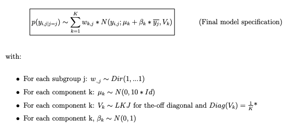

# Bayesian Hierarchical Mixture Clustering Model
Clustering model designed to find cardiometabolic phenotypes in different subgroups of a population.

### Model Aims

This model was developed during my doctoral research at Imperial College London. 
In the process of clustering multiple similar subgroups, two main strategies can be employed: clustering jointly and clustering separately. 
Joint clustering involves the simultaneous analysis of all subgroups to identify common patterns or groups, effectively treating
the combined data as a singular entity. In contrast, separate clustering entails analyzing each subgroup independently, without considering potential correlations or commonalities
between them. While clustering jointly will aim at partitioning all individuals aggregated together rather than
finding partitions within each group, clustering each subgroup separately captures the unique characteristics of each subgroup but comparison of the results is at best impractical. 

The Bayesian Hierarchical Mixture Clustering Model I have developed here seeks an in-between of clustering separately and jointly. 
This model can identify comparable phenotypes across subgroups while also capturing subgroup specificities. 
Specifically the aim of this model are: 

- To identify comparable phenotypes across multiple subgroups. To facilitate meaningful comparisons the model must identify analogous phenotypes across subgroups
that can be matched one by one.
- To capture subgroup specificities. Specifically, the characteristics of the identified
phenotypes and their prevalence should be able to differ moderately between subgroups if suggested by the data while remaining comparable.
- Because similar relationships between risk factors are expected across subgroups due to shared biological processes, the model should be able to borrow some of the
shared information between subgroups.

### Model Features and assumptions

- There are similar cardiometabolic and renal phenotypes across subgroups with different prevalences, therefore the weights of the mixture will be both cluster and
subgroup-specific.
- The same cardiometabolic and renal phenotype may have slightly different mean risk factor levels across subgroups, therefore cluster means are allowed to differ
across subgroups by introducing a small perturbation that is added to shared global cluster means.
- The more difference there is between a subgroup and the rest of the population the more difference we can expect on its phenotypes, therefore the perturbation 
should be dependent on the difference between subgroup means yj and overall mean.
- Similar correlations between risk factors are expected across subgroups but not necessarily across clusters therefore the covariance matrix is cluster-specific but the
shared across subgroups

### Final Model Specification

### Usage 

All variables are scaled to have a global mean of 0 and a standard deviation of 1 before clustering.
